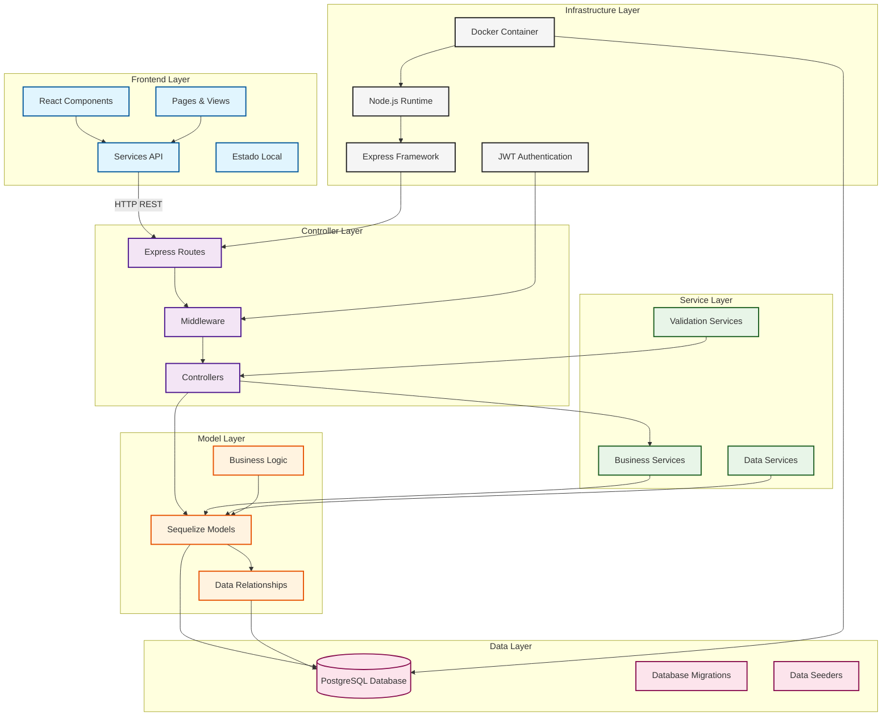

# 🧱 Arquitetura do Sistema Adote Fácil

## 1. Arquitetura Identificada

O sistema **Adote Fácil** adota uma **arquitetura em camadas baseada no padrão MVC (Model-View-Controller)**, estruturada em um modelo **cliente-servidor**.  
O projeto é composto por dois módulos principais: **frontend (React)** e **backend (Node.js + Express)**, configurando uma separação clara entre a camada de apresentação e a camada de lógica de negócio.

### 🔹 Características Gerais

- **Frontend:** Interface do usuário desenvolvida em **React + Vite**.
- **Backend:** API RESTful construída com **Node.js e Express**.
- **Banco de Dados:** **PostgreSQL**, manipulado via **Sequelize ORM**.
- **Comunicação:** HTTP/HTTPS por meio de endpoints REST.
- **Arquitetura:** MVC com separação de responsabilidades por camadas.

---

## 2. Justificativa da Arquitetura

### 🧩 Padrão MVC

- **Models:** Definidos no diretório `backend/src/models/`, representam entidades e regras de acesso a dados (ORM Sequelize).
- **Controllers:** Localizados em `backend/src/controllers/`, contêm a lógica de negócio e controlam o fluxo das requisições HTTP.
- **Views:** Representadas pelo **frontend React**, em `frontend/src/`, responsável pela renderização e interação com o usuário.

Essa estrutura favorece **cohesão interna** e **baixo acoplamento**, permitindo manutenção facilitada, testes unitários e escalabilidade futura.

### ⚙️ Padrão Cliente-Servidor

A comunicação ocorre via **requisições HTTP** entre o cliente React e a API Node.js.  
Cada componente pode evoluir de forma independente, mantendo a coerência da aplicação.

---

## 3. Diagrama de Componentes

| Categoria         | Tecnologia / Padrão | Descrição                               |
| ----------------- | ------------------- | --------------------------------------- |
| Framework Backend | Express.js          | Criação da API e gerenciamento de rotas |

| ORM | Sequelize | Mapeamento objeto-relacional com PostgreSQL |

| Frontend | React + Vite | Interface dinâmica e reativa |

| Estilização | Styled Components / CSS Modules | Organização e escopo de estilos |

| Banco de Dados | PostgreSQL | Persistência relacional |

| Containerização | Docker Compose | Orquestração de containers (frontend + backend + DB) |

| Autenticação | JWT | Controle de sessão e autenticação segura |

| Arquitetura | MVC + Camadas de Serviço | Separação de responsabilidades |

## Descrição:

### Frontend (React)

Interface principal com rotas e componentes como Home, Perfil, Cadastro de Animais, etc.

Comunicação via Axios com o backend.

Usa React Router para navegação SPA e styled-components para estilização.

### Backend (Node.js + Express)

API REST que expõe endpoints para autenticação, cadastro e listagem de animais e usuários.

Utiliza Sequelize para mapear entidades e acessar o PostgreSQL.

Implementa JWT para autenticação e proteção de rotas.

### Banco de Dados (PostgreSQL)

Armazena informações de usuários, abrigos e animais.

Relacionamentos bem definidos (ex: um abrigo possui vários animais).

### Docker / Infraestrutura

Contêineres para o backend, frontend e banco de dados.

Facilita a implantação e a replicação do ambiente.

---

## 4. Estrutura de Diretórios

adote-facil/
├── backend/
│ ├── src/
│ │ ├── controllers/ # Camada Controller
│ │ ├── models/ # Camada Model (ORM Sequelize)
│ │ ├── routes/ # Definição de rotas REST
│ │ ├── services/ # Lógica de negócio auxiliar
│ │ └── config/ # Configuração de banco e ambiente
│ ├── package.json
│ └── Dockerfile
│
├── frontend/
│ ├── src/
│ │ ├── components/ # Componentes reutilizáveis (View)
│ │ ├── pages/ # Páginas principais
│ │ ├── services/ # Comunicação com a API
│ │ └── App.jsx
│ ├── vite.config.js
│ └── package.json
│
├── docker-compose.yml
└── documentacao/
└── arquitetura.md

---

## 5. Fluxo de Requisição

Usuário (React) → Rotas Express → Middleware → Controller → Service → Model → Banco de Dados
↓
JSON Response ← Dados Formatados

---

### Resumo do fluxo:

O usuário interage com a interface React.

A requisição é enviada à API Node.js via HTTP.

O Controller processa a requisição, aciona o Service e consulta o Model.

O Model interage com o banco de dados PostgreSQL.

A resposta é devolvida em formato JSON ao frontend.

---

## 6. Tecnologias e Padrões Adicionais

Stack Tecnológica
Categoria Tecnologia / Padrão Descrição
Framework Backend Express.js Criação da API e gerenciamento de rotas
ORM Sequelize Mapeamento objeto-relacional com PostgreSQL
Frontend React + Vite Interface dinâmica e reativa
Estilização Styled Components / CSS Modules Organização e escopo de estilos
Banco de Dados PostgreSQL Persistência relacional
Containerização Docker Compose Orquestração de containers (frontend + backend + DB)
Autenticação JWT Controle de sessão e autenticação segura
Arquitetura MVC + Camadas de Serviço Separação de responsabilidades

---

## 7. Conclusão

A arquitetura do Adote Fácil combina simplicidade de um monólito modular com os benefícios de uma arquitetura em camadas baseada em MVC.
A separação clara entre frontend e backend, aliada ao uso de padrões de projeto (Service e Repository), oferece:

Melhor manutenção e evolução;

Reuso de código e testes isolados;

Flexibilidade para migração futura a microsserviços.

📦 Responsável pela análise: Albert Johnson
📅 Etapa 2 – Análise da Arquitetura de Software
🔗 Entrega: Pull Request 2 para o repositório original
