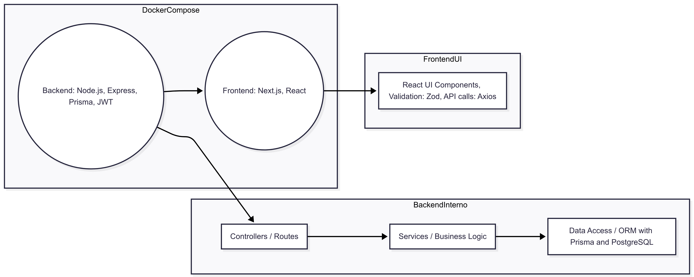

# Análise da arquitetura de software

## 1. Arquitetura adotada
O sistema é implementado como uma aplicação monolítica dividida em dois módulos principais:

* **Backend**: construído com Node.js + Express e Prisma, executando toda a lógica de API, autenticação JWT, regras de negócio e acesso ao banco de dados.
* **Frontend**: Next.js + React, consumindo a API REST por meio de chamadas HTTP, realizando validação e gerenciando upload de imagens.

Internamente, o backend está organizado em camadas:

* **Camada de rotas (controllers)**: expõe endpoints como `/users`, `/animals`, `/users/chats`.
* **Camada de serviço (services)**: lógica de negócio, como cadastro de usuário, chat, atualização de status dos animais.
* **Camada de persistência (ORM – Prisma + PostgreSQL)**: abstrai operações de banco de dados.

Esse padrão segue o estilo MVC modificado (ou arquitetura em camadas), centralizando o backend como monolito. Apesar do frontend e backend estarem desacoplados quanto ao consumo da API, ambos fazem parte do mesmo repositório e são empacotados juntos via Docker Compose, caracterizando um monólito para fins de deploy, com frontend e backend em contêineres separados.

**Justificativa**

* O uso de Node/Express + Prisma e a estrutura consolidada de rotas, serviços e modelos indicam uma separação em camadas bem definida.
* Toda a lógica backend está concentrada em um único serviço, sem microserviços nem comunicação distribuída.
* A configuração em contêineres separados facilita desenvolvimento e deploy simplificado, típico de monólitos desacoplados.

---

## 2. Diagrama de componentes

