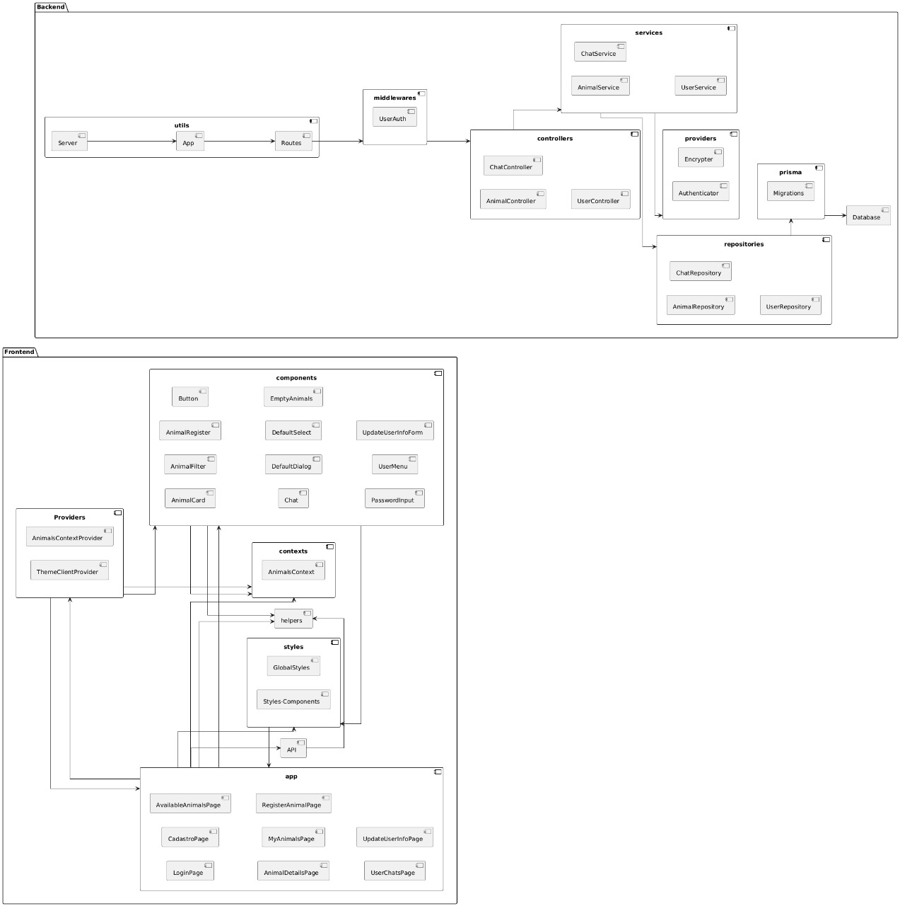

# Análise da arquitetura do projeto "Adote Fácil"

O sistema do projeto é implementado como uma aplicação monolítica, com características modular, divida em dois módulos principais, sendo eles: 

* **Backend**: uma aplicação Node.js/Express e Prisma que roda na porta 8080, aplicando regras de negócio, acesso ao banco de dados, lógica da API e a autentição JWT.

* **Frontend**: uma aplicação Next.js + React que roda na porta 3000, consumindo a API REST por meio de chamadas HTTP e se comunicando com backend.

O módulo do **backend** está organizado através do estilo MVC (arquitetura em camadas), sendo possível visualizar as camadas de atuação do sistema e suas respectivas responsabilidades.

* **Controllers** -> trabalham com os endpoints do sistema, validam as entradas dos dados e chamam serviços apropriados para cada rota. 
* **Middlewares** -> interceptam requisiçoes HTTP para realizar validações antes das mesmas chegarem a camada de Controller.
* **Providers** -> trabalham com a autenticação e criptografia de dados.
* **Repositories** -> interagem com o banco de dados, responsáveis por realizar transações no banco de dados, lógica de persistência. 
* **Services** -> local em que se encontra a lógica de negócio do sistema, eles interagem com os repositórios e atuam nas operações realizadas. 

**Justificativa**: A decisão de separar o backend do frontend em contêineres separados, permite que o desenvolvimento de ambos ocorra de forma independente, ou seja, facilitando o escalonamento, flexibilidade e o deploy do sistema. 

Além disso, na parte do backend, a decisão de utilizar a arquitetura em camadas promove a organização, manutenibilidade e os testes realizados nos códigos, centralizando esse módulo como um monolito. 

# Diagrama de componentes do sistema "Adote Fácil"

