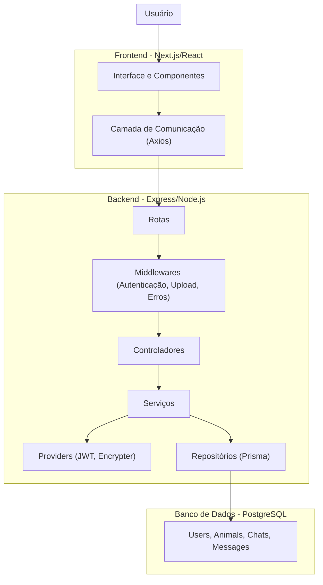

# Arquitetura do Sistema - Adote Fácil

Este documento descreve a arquitetura de software adotada no projeto **Adote Fácil**, detalhando os padrões utilizados, a estrutura dos componentes e o fluxo de dados entre eles.

---

## 1. Modelo Arquitetural

O sistema Adote Fácil adota o modelo **Cliente-Servidor** e pode ser classificado como um **Monólito Modular com Frontend Separado**.

- **Cliente-Servidor:**  
  O frontend e o backend são desenvolvidos como aplicações distintas que se comunicam através de uma API REST.  
  O cliente (frontend) roda no navegador e envia requisições HTTP ao servidor (backend), que centraliza toda a lógica de negócio.

- **Monólito Modular:**  
  O backend é implantado como uma única aplicação, mas segue a separação em camadas (rotas, controladores, serviços, repositórios), o que facilita manutenção, escalabilidade e testabilidade.

Essa abordagem oferece simplicidade na implantação e clareza na organização do código, sem abrir mão da modularidade.

---

## 2. Componentes Principais

### **Frontend (Cliente)**

- Desenvolvido como uma SPA com **Next.js/React**.
- Responsável pela interface e experiência do usuário.
- Comunica-se com o backend via **Axios** (HTTP/JSON).
- Utiliza **Zod** para validação de dados de entrada.

### **Backend (Servidor)**

- Construído com **Node.js** e **Express**.
- Estrutura organizada em camadas:
  - **Rotas (Routes):** mapeiam endpoints HTTP.
  - **Controladores (Controllers):** validam requisições e chamam os serviços adequados.
  - **Serviços (Services):** implementam as regras de negócio.
  - **Repositórios (Repositories):** camada de persistência usando **Prisma**.
  - **Middlewares:** autenticação com **JWT**, tratamento de erros e uploads com **Multer**.

### **Banco de Dados**

- Banco relacional **PostgreSQL**.
- Gerenciado com **Prisma ORM**, garantindo segurança de tipos e abstração da persistência.
- Entidades principais:
  - **Users** (usuários da plataforma)
  - **Animals** (animais disponíveis para adoção)
  - **AnimalImages** (imagens dos animais)
  - **Chats** (conversas entre usuários)
  - **Messages** (mensagens trocadas nos chats)

### **Infraestrutura**

- Containerização com **Docker Compose**, orquestrando:
  - Backend (API Node.js/Express)
  - Frontend (Next.js/React)
  - Banco de Dados (PostgreSQL)
- Uso de volumes persistentes e variáveis de ambiente.

---

## 3. Fluxo de Comunicação

A comunicação entre cliente e servidor ocorre via **API RESTful**:

1. O usuário interage com a interface no navegador.
2. O frontend dispara requisições HTTP (GET, POST, PATCH, DELETE).
3. O backend processa a requisição, aplica regras de negócio, consulta o banco via Prisma e retorna uma resposta JSON.
4. O frontend renderiza os dados de forma dinâmica.

---

## 4. Diagrama de Componentes

```mermaid
flowchart TD
    subgraph Usuario["Usuário"]
    end

    subgraph Frontend["Frontend - Next.js/React"]
        UI["Interface e Componentes"]
        AXIOS["Camada de Comunicação (Axios)"]
    end

    subgraph Backend["Backend - Express/Node.js"]
        ROUTES["Rotas"]
        MIDDLEWARES["Middlewares (Autenticação, Upload, Erros)"]
        CONTROLLERS["Controladores"]
        SERVICES["Serviços"]
        PROVIDERS["Providers (JWT, Encrypter)"]
        REPOSITORIES["Repositórios (Prisma)"]
    end

    subgraph Database["Banco de Dados - PostgreSQL"]
        ENTIDADES["Users, Animals, Chats, Messages"]
    end

    Usuario --> UI
    UI --> AXIOS
    AXIOS --> ROUTES
    ROUTES --> MIDDLEWARES
    MIDDLEWARES --> CONTROLLERS
    CONTROLLERS --> SERVICES
    SERVICES --> PROVIDERS
    SERVICES --> REPOSITORIES
    REPOSITORIES --> ENTIDADES
```
