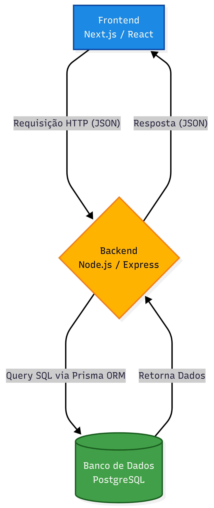

# Arquitetura do Sistema - Adote Fácil

Este documento descreve a arquitetura de software adotada no projeto **Adote Fácil**, detalhando o modelo arquitetural, a estrutura dos componentes e o fluxo de dados entre eles.

---

## 1. Modelo Arquitetural Adotado

A arquitetura do Adote Fácil pode ser definida como um **Monólito Modular com Frontend Separado**, operando sob o modelo **Cliente-Servidor**.

Abaixo, detalhamos os conceitos aplicados ao contexto do projeto:

### 1.1. Cliente-Servidor
Descreve a **relação** entre as duas principais partes do sistema. O projeto possui uma aplicação de **Cliente (Frontend)**, que roda no navegador do usuário, e uma aplicação de **Servidor (Backend)**, que centraliza a lógica de negócio. Elas são independentes e se comunicam através de uma API REST via protocolo HTTP.

### 1.2. Monólito Modular (Backend)
Descreve a **estrutura interna** do Backend.
- **Monólito:** Todas as funcionalidades (gerenciamento de usuários, animais, chat, autenticação) são construídas e implantadas como uma **única unidade de software** (um único servidor Node.js).
- **Modular:** O código é altamente organizado em camadas com responsabilidades distintas (Controllers, Services, Models), o que facilita a manutenção e evita o "Spaghetti Code".

Essa abordagem combina a simplicidade de implantação de um monólito com a flexibilidade de ter uma interface de usuário moderna e desacoplada.

---

## 2. Diagrama de Componentes (Alto Nível)

O diagrama a seguir foi desenvolvido utilizando o Mermaid Live Editor e ilustra a visão macro da arquitetura, mostrando o Cliente, o Servidor Monolítico e o Banco de Dados, bem como o fluxo de interação entre eles.

  

