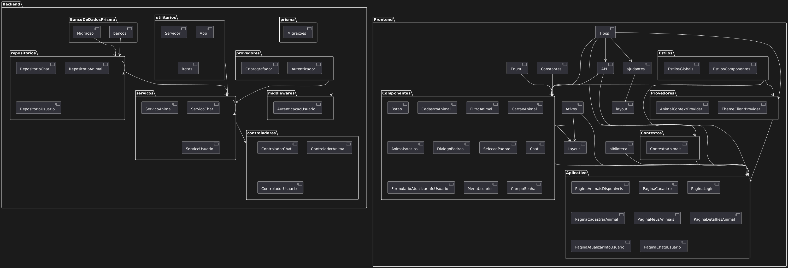

Análise da Arquitetura do Sistema Adote-Fácil

• Identifique e descreva a arquitetura adotada no projeto (ex: MVC, camadas, monólito, etc). Justifique.

 
<strong>Resposta</strong>

O sistema Adote-Fácil é uma aplicação web voltada para a adoção de animais.
Ao analisar sua arquitetura, observa-se que o sistema adota uma arquitetura em camadas dentro de um monólito.

Apesar de apresentar características semelhantes ao padrão MVC, o projeto possui apenas influência do MVC, não se caracterizando como um MVC puro. Isso ocorre porque os dados, as regras de negócio, a interface e os controles não estão fortemente acoplados, mas sim separados, conforme observado nas diferentes aplicações e pastas do projeto.

O sistema é composto por frontend, backend e banco de dados, todos administrados por meio de containers Docker.

 
<strong>Componentes Principais</strong>

### Frontend - (React) é a interface que o usuário vê

O frontend é responsável pela interface com o usuário e é executado no navegador.
Ele se comunica com o backend por meio de requisições HTTP. Por ser totalmente separado, essa abordagem foge do MVC tradicional.
O frontend representa a View, porém não faz parte do mesmo projeto do backend e não é renderizado por ele. <!-- O frontend não acessa o banco diretamente -->

### Backend - (Node.js + Express) é a API

O backend concentra as regras de negócio do sistema e expõe uma API consumida
pelo frontend. Nele encontram-se as rotas e controllers, além da conexão com o
banco de dados realizada por meio do Prisma ORM, responsável pelo acesso e
pela persistência dos dados.

Observa-se que não há Views no backend. Dessa forma, há camadas bem definidas,
caracterizando uma arquitetura em camadas (Controller → Service → Data Access).
Portanto, o backend do sistema adota uma arquitetura monolítica em camadas, com
influência do padrão MVC, enquanto o frontend é uma aplicação separada que
consome a API via HTTP.

### Infraestrutura (Docker) - atrás da API

O arquivo docker-compose.yml é responsável por subir os containers do sistema,
incluindo backend, frontend e banco de dados.

 
<strong>Comunicação entre os Componentes</strong>

O usuário interage com o frontend.

O frontend envia requisições HTTP (como dados de autenticação, cadastro de usuários e animais, e upload de imagens) para o backend.

O backend processa a requisição e acessa o banco de dados.

A resposta é retornada ao frontend.

<strong> Diagrama de Componentes</strong>

