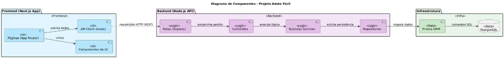

# Análise Arquitetural - Projeto Adote Fácil

Este documento resume a estrutura do sistema Adote Fácil para a disciplina de Engenharia de Software II. Abaixo, identifico o padrão utilizado e explico como o código está organizado.

## 1. Identificação da Arquitetura

O projeto foi construído utilizando uma **Arquitetura em Camadas** no backend e uma estrutura baseada em **Componentes** no frontend. De forma geral, o sistema funciona como um **Monólito**, já que tanto o cliente quanto o servidor estão no mesmo repositório e rodam juntos via Docker.

## 2. Justificativa

Conforme analisado no repositório, a divisão de responsabilidades está bem clara:

### Backend (Node.js + TypeScript)
No `backend/src`, dá para ver que o projeto não mistura tudo num arquivo só. Ele separa o que é rota, o que é lógica e o que é banco de dados:
* **Rotas:** O arquivo `routes.ts` só serve para criar os caminhos (endpoints) e chamar o controller certo.
* **Controllers:** Estão na pasta `src/controllers/`. Eles recebem o que vem do frontend, mas não decidem as regras do sistema, apenas passam os dados para frente.
* **Services:** Ficam em `src/services/`. É aqui que a "mágica" acontece. Toda a regra de negócio (como validar se um usuário pode adotar ou não) fica aqui. É a parte mais importante.
* **Repositories:** Localizados em `src/repositories/`. Eles usam o Prisma para falar com o banco. Assim, se um dia a gente mudar o banco, só precisa mexer aqui.

### Frontend (Next.js)
No lado do `frontend/src`, o projeto segue o padrão moderno do React:
* **Componentes:** Coisas que se repetem, como botões e cards de animais, ficam em `src/components/`. Isso facilita muito o reuso.
* **Pages/App:** A estrutura de pastas em `src/app/` define as rotas da página automaticamente.
* **Consumo de API:** O frontend usa o Axios para buscar os dados do backend, mantendo a interface separada da lógica de dados.

## 3. Diagrama de Componentes

Abaixo, o diagrama que ilustra a comunicação entre o frontend, as camadas do backend e o banco de dados:

