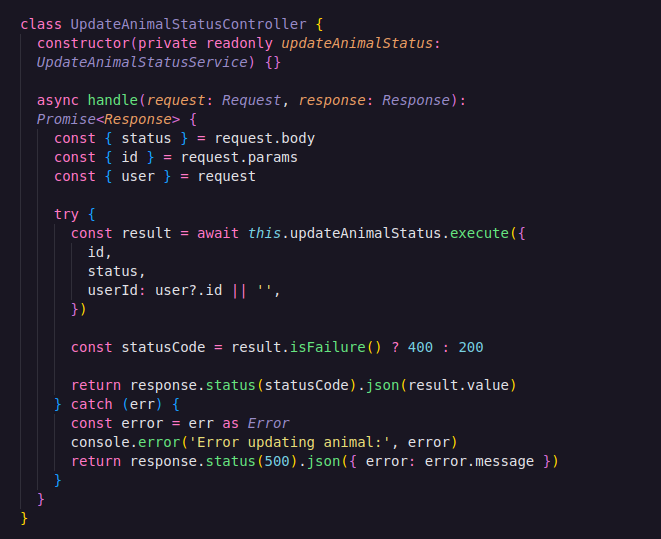
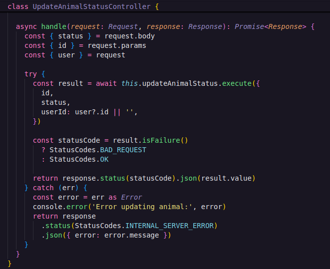
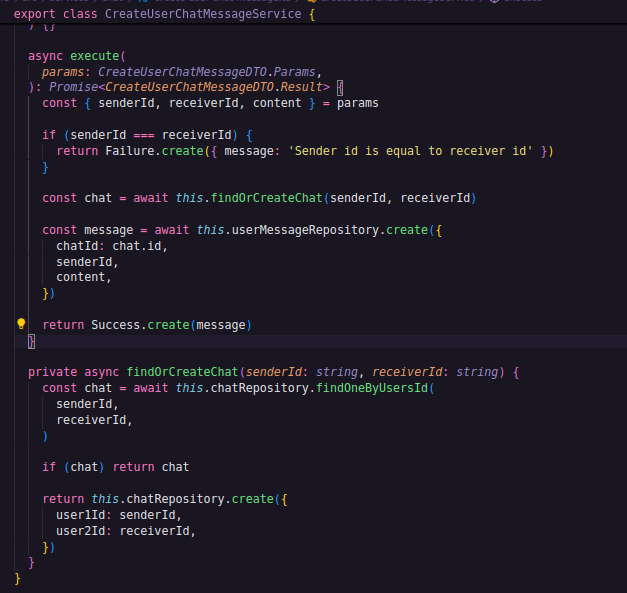
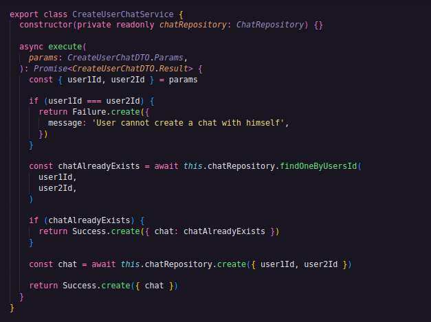
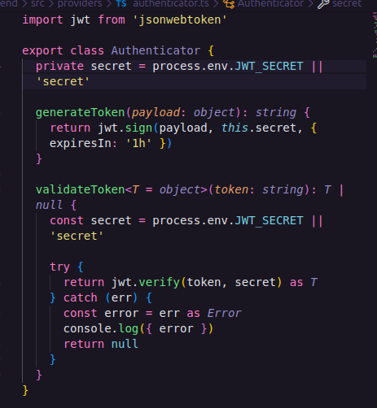

# Code Smells e Refatorações

### 1. Uso de números mágicos nos controllers
O primeiro code smell encontrado está relacionado ao uso de números mágicos nos controllers em `backend/src/controllers`:

Os códigos de status HTTP estão sendo utilizados diretamente como valores numéricos (por exemplo, 200, 400, 500), sem uma representação que indique claramente seu significado, o que pode compormeter a legibilidade para um desenvolvedor com menos experiência.

Como proposta de refatoração, pode ser utilizada a biblioteca StatusCodes, na qual oferece um ENUM com os códigos de status da requisição HTTP utilizados na aplicação e nomeados de acordo com o status ao qual representa, dessa maneira estará claro qual é o status code e seu motivo. Após a refatoração:

### 2. Duplicação de lógica de negócio
Nos arquivos `create-user-chat.ts` e `create-user-chat-message.ts`, localizados em `backend/src/services/chat`, foi identificada uma duplicação de lógica de negócio.

Em ambos os métodos `execute(...)`, há a mesma regra: verificar se já existe um chat entre dois usuários e, caso não exista, criar um novo chat. Essa repetição caracteriza violação do princípio **DRY (Don't Repeat Yourself)**, pois a mesma regra está implementada em mais de um ponto do sistema.

CreateUserChatMessageService:

CreateUserChatService:

Como proposta de refatoração, foi criada uma classe de serviço chamada ChatDomainService, responsável por centralizar essa regra em um único método (findOrCreate). Dessa forma, ambos os serviços passam a reutilizar a mesma implementação, eliminando a duplicação.

Com essa abordagem, qualquer alteração futura na lógica de verificação ou criação de chats precisará ser realizada em apenas um local, melhorando a manutenção do sistema.

### 3. Duplicação de código

No arquivo `authenticator.ts` localizado em `backend/src/providers`, foi identificada uma duplicação de código para obter a chave secreta do token JWT no método `validateToken(...)`.
Essa duplicação viola o princípio DRY (Don't Repeat Yourself) e pode gerar inconsistências caso a forma de obtenção da chave seja alterada futuramente.

Como proposta de refatoração, foi retirada a obtenção da variável dentro do método, passando a utilizar o atributo privado definido na classe.
