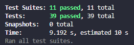
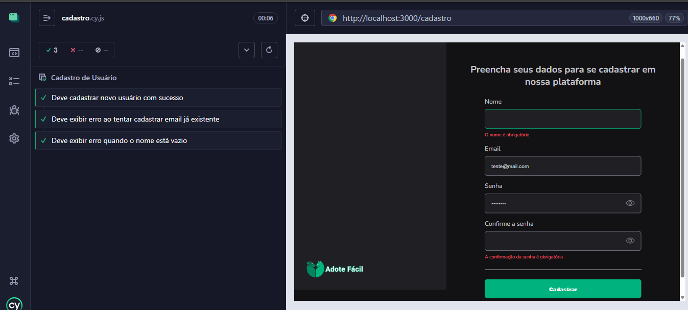

# Testes Automatizados – Adote Fácil

## Estratégia de Testes
O projeto utiliza duas camadas principais de testes:
- **Unitários (Jest)**: focados em serviços (`User`, `Animal`, `Chat`).
- **Aceitação (Cypress)**: validam cenários reais no frontend.

## Testes Unitários

### Ferramenta
- **Jest** + `jest-mock-extended` para mocks.
- Repositórios e serviços testados isoladamente.

### Cobertura Atual
- **Animal**: criação, atualização de status, listagem.
- **User**: criação, atualização, login.
- **Chat**: criação e busca de chats.

### Melhorias Sugeridas
- Adicionar casos de erro (falha no repositório, parâmetros inválidos).
- Validar mensagens de erro.
- Criar testes de integração com banco em memória (SQLite/Prisma).

### Como rodar
```bash
cd backend
npm install
npm test
```

### Resultado esperado


## Testes de Aceitação (Cypress)

### Ferramenta
- **Cypress 12+**

### Configuração
Definir `baseUrl` em `cypress.config.js`:
```javascript
module.exports = {
  e2e: {
    baseUrl: "http://localhost:3000"
  }
}
```

#### Cadastro de Usuário
- **Cadastro válido** → usuário criado com sucesso.  
- **Email duplicado** → exibe mensagem de erro.  
- **Nome vazio** → mensagem de validação exibida.  

#### Login
- **Login válido** → redireciona para dashboard.  
- **Senha incorreta** → mensagem de erro exibida.   
- **Email não preenchido** → validação bloqueia envio.  

### Como rodar
```bash
cd frontend
npm install
npx cypress open
```

### Resultados Esperados



