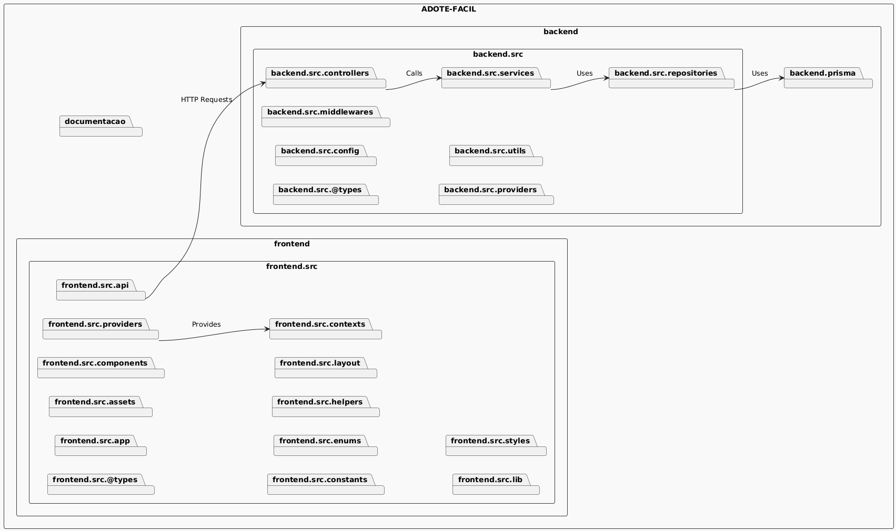

# Análise da Arquitetura Software Adote Fácil

## Arquitetura Adotada

Arquiterura em Camadas

### Justificativa

O projeto Adote Fácil utiliza em sua etrutura a arquitetura em camadas. Essa escolha foi feita com base na clareza e separação de responsabilidades entre camada de controle "controllers", lógica de negocios "services"e camada de persistencia de dados "repositories". Essa organização facilita a manutenção, teste e reutilização do código, respeitando o princípio da separação de responsabilidades Além disso, o sistema é separados em dois diretórios principais. Ademais projeto segue o estilo é monolítico, onde todo o sistema frontend e backend estao contido no mesmo repositório com deploy unificado.

Backend: servidor Express em Node.js + Prisma, contendo a lógica da aplicação e persistência.

Frontend: aplicação SPA separada (provavelmente React ou similar), que consome a API do backend.

## Diagrama de Componentes

A seguir, o diagrama de componentes representando a estrutura do sistema:

